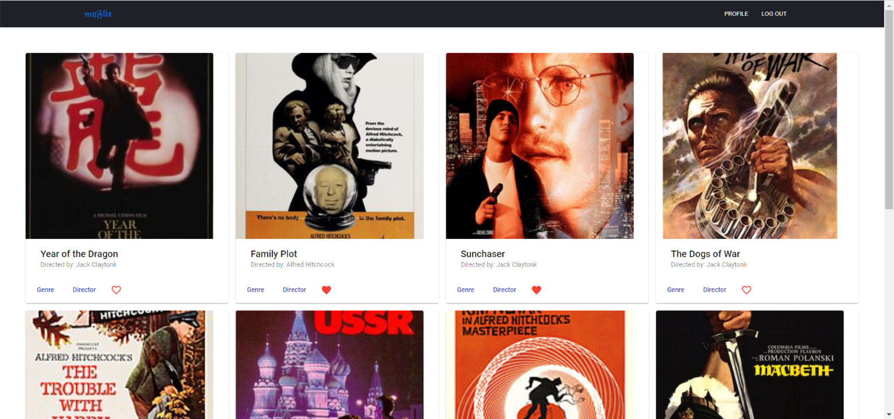
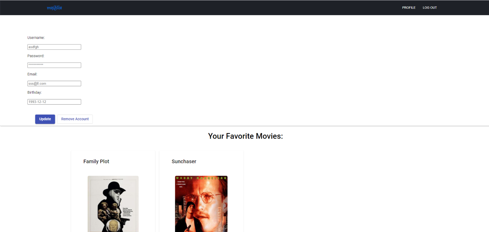

# filmFlix

filmFlix is the client-side of a movie database application built using Angular with an existing server-side (REST API) and MongoDB database.

This web application provides users with the access to information about different movies, directors and genres. Users are able to sign up, update personal information, and create a list of their favorite movies.


View the website built with React [here](https://github.com/wafachaari/myFlix-client).

View the back-end REST API database [here](https://github.com/wafachaari/movie-api).




## Quick Start 🚀

### Development server

Run the below command for a dev server. Navigate to `http://localhost:4200/`. The app will automatically reload if you change any of the source files.

```bash
ng serve
```

### Further help

To get more help on the Angular CLI use `ng help` or go check out the [Angular CLI Overview and Command Reference](https://angular.io/cli) page.

## Features

- Allows users to see a list of all movies in the database
- Allows users to see a fliter list of all movies in the database by title
- Allows users to get detailed information about a single movie by movie title
- Allows users to get detailed information about a genre by genre name
- Allows users to get detailed information about a director by name
- Allows new users to create an user account
- Allows existing users to update their user info or to delete their account
- Allows existing users to add or remove movies to/from their list of favorites

### Author

[Wafa Chaari](https://wafachaari.github.io)

 
